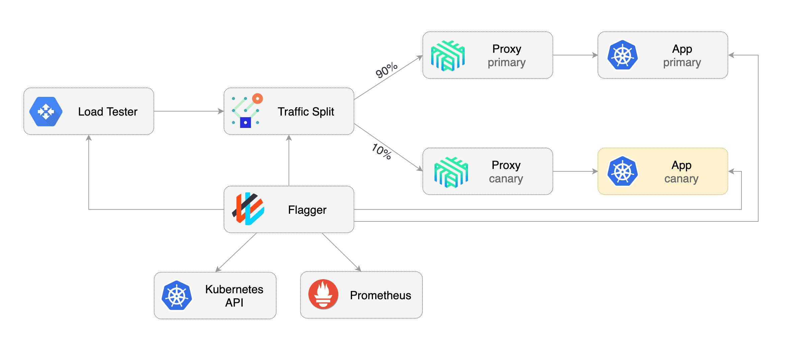

# flagger-linkerd

There are many service mesh implementations on k8s, we will focus on Linkerd here.
Istio and Linkerd are the two leading solutions. This is a good article on the 
[comparison of Istio and Linkerd](https://glasnostic.com/blog/comparing-service-meshes-linkerd-vs-istio). 
There is also 
[AWS AppMesh](https://aws.amazon.com/app-mesh/), you can see my 
[testing AppMesh with Flagger](https://github.com/seizadi/appmesh). 
[Contour](https://projectcontour.io/) is another mesh solution, sponsored by
[VMware](https://www.vmware.com/)
focused on north/south flows (e.g. Ingress/Load Balancer), 
[here is FAQ on it](https://projectcontour.io/resources/faq/).

Here is a
[performance comparision of Istio versus Linkerd](https://medium.com/@ihcsim/linkerd-2-0-and-istio-performance-benchmark-df290101c2bb)
that was done in Dec 2018 for KubeCon. Since there have been many release, maybe that
analysis is old and probably stand to be redone with 
[newer version of Istio](https://github.com/istio/tools/tree/release-1.6/perf/benchmark).

This project is based on this WeaveWorks
[Tutorial](https://github.com/weaveworks/flagger/blob/master/docs/gitbook/tutorials/linkerd-progressive-delivery.md).



The following 
[Linkerd canary guide](https://linkerd.io/2/tasks/canary-release/) 
is a good description of the Linkerd operational elments and follow the same example.

## References
[Flagger Docs](https://docs.flagger.app/)

## Setup cluster

**** CAUTION THE STEPS BELOW WILL DELETE YOUR MINIKUBE INSTALLATION ****

If you are new to Linkerd you can follow their 
[setup instructions](https://linkerd.io/2/getting-started/).

The Linkerd guide has following manifest for Flagger and Test app that is a 
Buyonet image, buoyantio/slow_cooker:1.2.0, 
bundled with NGINX proxy:
```bash
kubectl create ns test && \
  kubectl apply -f https://run.linkerd.io/flagger.yml
```
We will follow the Flagger setup but the basic operation is the same.

At the time of running my tests, the version that I am running:
```bash
kubectl version --short
Client Version: v1.18.0
Server Version: v1.18.3
```

The minikube k8s cluster with Linkerd and Flagger is created using:
```bash
make flagger
```

In another session you can run dashboard for Linkerd and Grafana dashbaords:
```bash
make dashboard
```

To get a high level view of what Flagger resources are being created:
```bash
> kubectl apply --dry-run=client -k github.com/weaveworks/flagger//kustomize/linkerd
customresourcedefinition.apiextensions.k8s.io/alertproviders.flagger.app created (dry run)
customresourcedefinition.apiextensions.k8s.io/canaries.flagger.app created (dry run)
customresourcedefinition.apiextensions.k8s.io/metrictemplates.flagger.app created (dry run)
serviceaccount/flagger created (dry run)
clusterrole.rbac.authorization.k8s.io/flagger created (dry run)
clusterrolebinding.rbac.authorization.k8s.io/flagger created (dry run)
deployment.apps/flagger created (dry run)
```

To create a test application there is kustomize config to build it:
```bash
kubectl apply -k .
```
You can run it using:
```bash
make test
```

You can check the status using:
```bash
make status
```
Here are the detail steps to create test application from the Flagger guide ....

Create a test namespace and enable Linkerd proxy injection:

```bash
kubectl create ns test
kubectl annotate namespace test linkerd.io/inject=enabled
```

Install the load testing service to generate traffic during the canary analysis:

```bash
kubectl apply -k github.com/weaveworks/flagger//kustomize/tester
```

Create a deployment and a horizontal pod autoscaler:

```bash
kubectl apply -k github.com/weaveworks/flagger//kustomize/podinfo
```

Create a canary custom resource for the podinfo deployment:

```yaml
apiVersion: flagger.app/v1beta1
kind: Canary
metadata:
  name: podinfo
  namespace: test
spec:
  # deployment reference
  targetRef:
    apiVersion: apps/v1
    kind: Deployment
    name: podinfo
  # HPA reference (optional)
  autoscalerRef:
    apiVersion: autoscaling/v2beta1
    kind: HorizontalPodAutoscaler
    name: podinfo
  # the maximum time in seconds for the canary deployment
  # to make progress before it is rollback (default 600s)
  progressDeadlineSeconds: 60
  service:
    # ClusterIP port number
    port: 9898
    # container port number or name (optional)
    targetPort: 9898
  analysis:
    # schedule interval (default 60s)
    interval: 30s
    # max number of failed metric checks before rollback
    threshold: 5
    # max traffic percentage routed to canary
    # percentage (0-100)
    maxWeight: 50
    # canary increment step
    # percentage (0-100)
    stepWeight: 5
    # Linkerd Prometheus checks
    metrics:
    - name: request-success-rate
      # minimum req success rate (non 5xx responses)
      # percentage (0-100)
      thresholdRange:
        min: 99
      interval: 1m
    - name: request-duration
      # maximum req duration P99
      # milliseconds
      thresholdRange:
        max: 500
      interval: 30s
    # testing (optional)
    webhooks:
      - name: acceptance-test
        type: pre-rollout
        url: http://flagger-loadtester.test/
        timeout: 30s
        metadata:
          type: bash
          cmd: "curl -sd 'test' http://podinfo-canary.test:9898/token | grep token"
      - name: load-test
        type: rollout
        url: http://flagger-loadtester.test/
        metadata:
          cmd: "hey -z 2m -q 10 -c 2 http://podinfo-canary.test:9898/"
```

Save the above resource as base/test/podinfo/canary.yaml and then apply it:

```bash
kubectl apply -f ./base/test/podinfo/canary.yaml
```

The Flagger controller is watching these definitions and will create some
new resources on your cluster. To watch as this happens, run:

```bash
kubectl -n test get ev --watch
```

A new deployment named podinfo-primary will be created with the same number of
replicas that podinfo has. Once the new pods are ready, the original deployment 
is scaled down to zero. This provides a deployment that is managed by Flagger as 
an implementation detail and maintains your original configuration files and workflows. 

When the canary analysis starts, Flagger will call the pre-rollout webhooks before 
routing traffic to the canary.
The canary analysis will run for five minutes while validating the HTTP metrics and 
rollout hooks every half a minute.

After a couple of seconds Flagger will create the canary objects:

```bash
# applied
deployment.apps/podinfo
horizontalpodautoscaler.autoscaling/podinfo
ingresses.extensions/podinfo
canary.flagger.app/podinfo

# generated
deployment.apps/podinfo-primary
horizontalpodautoscaler.autoscaling/podinfo-primary
service/podinfo
service/podinfo-canary
service/podinfo-primary
trafficsplits.split.smi-spec.io/podinfo
```

The traffic split CRD is intersting to look at:
```bash
k -n test get TrafficSplit -o yaml
apiVersion: v1
items:
- apiVersion: split.smi-spec.io/v1alpha1
  kind: TrafficSplit
  metadata:
    creationTimestamp: "2020-06-12T02:01:38Z"
    generation: 1
    managedFields:
    - apiVersion: split.smi-spec.io/v1alpha1
      fieldsType: FieldsV1
      fieldsV1:
        f:metadata:
          f:ownerReferences: {}
        f:spec:
          .: {}
          f:backends: {}
          f:service: {}
      manager: flagger
      operation: Update
      time: "2020-06-12T02:01:38Z"
    name: podinfo
    namespace: test
    ownerReferences:
    - apiVersion: flagger.app/v1beta1
      blockOwnerDeletion: true
      controller: true
      kind: Canary
      name: podinfo
      uid: fbeb7e3d-f203-4548-be58-7f2f5ae7923d
    resourceVersion: "60735"
    selfLink: /apis/split.smi-spec.io/v1alpha1/namespaces/test/trafficsplits/podinfo
    uid: 9724d59a-fbf7-4913-93d5-71d1d585a057
  spec:
    backends:
    - service: podinfo-canary
      weight: "0"
    - service: podinfo-primary
      weight: "100"
    service: podinfo
kind: List
metadata:
  resourceVersion: ""
  selfLink: ""
```

You should be able to observe the backend reference as Flagger update the canary and update
traffic flow based on analysis:
```yaml
  spec:
    backends:
    - service: podinfo-canary
      weight: "0"
    - service: podinfo-primary
      weight: "100"
    service: podinfo
```

Verify that everything has started up successfully by running:
```bash
kubectl -n test rollout status deploy podinfo-primary
```

After the boostrap, the podinfo deployment will be scaled to zero and the traffic to `podinfo.test`
will be routed to the primary pods.
During the canary analysis, the `podinfo-canary.test` address can be used to target directly the canary pods.


Traffic splitting occurs on the client side of the connection and not the server side. 
Any requests coming from outside the mesh will not be split and will always be directed 
to the primary. A service of type LoadBalancer will exhibit this behavior as the 
source is not part of the mesh. To split external traffic, add your ingress controller to the mesh.

Check it out by forwarding the service locally and opening 
[http://localhost:9898](http://localhost:9898) locally by running:
```bash
kubectl -n test port-forward svc/podinfo 9898
```

## Flux Installation
The two guides at this point test the canary, but decide to run Flux and test the canary
promotion with that installed.

## Debug
Found that we could not get metrics:
```bash
❯ kubectl -n test get events --watch
LAST SEEN   TYPE      REASON                    OBJECT                                    MESSAGE
20s         Warning   FailedGetResourceMetric   horizontalpodautoscaler/podinfo-primary   unable to get metrics for resource cpu: unable to fetch metrics from resource metrics API: the server could not find the requested resource (get pods.metrics.k8s.io)
0s          Warning   FailedComputeMetricsReplicas   horizontalpodautoscaler/podinfo-primary   invalid metrics (1 invalid out of 1), first error is: failed to get cpu utilization: unable to get metrics for resource cpu: unable to fetch metrics from resource metrics API: the server could not find the requested resource (get pods.metrics.k8s.io)
```
I think the 
[Metrics Server](https://github.com/kubernetes-sigs/metrics-server) is missing from my 
installation but I don't see where I suppose to have installed it! To install it:
```bash
kubectl apply -f https://github.com/kubernetes-sigs/metrics-server/releases/download/v0.3.6/components.yaml
```
or for Minikube you can enable the metrics-server addon:
```bash
minikube addons enable metrics-server
```
Now I have a different problem with HPA:
```bash
> k -n test get events --watch
...
0s          Warning   FailedGetResourceMetric        horizontalpodautoscaler/podinfo-primary   unable to get metrics for resource cpu: no metrics returned from resource metrics API

> k -n test get hpa
NAME              REFERENCE                    TARGETS         MINPODS   MAXPODS   REPLICAS   AGE
podinfo           Deployment/podinfo           <unknown>/99%   2         4         0          12m
podinfo-primary   Deployment/podinfo-primary   <unknown>/99%   2         4         2          11m
```
Followed the following 
[issue about Metrics Server](https://github.com/kubernetes/kubernetes/issues/79365) that got me to the 
[root cause in Linkerd](https://github.com/linkerd/linkerd2/issues/2596).

HPA requires resource requests to work. By default Linkerd doesn't add those to make sure 
everything works in constrained environments (such as minikube). 
Here is the 
[Linkerd documentation on proxy config](https://linkerd.io/2/reference/proxy-configuration/).
To fix this add the following annotations to the deployment:
```yaml
spec:
  template:
    metadata:
      annotations:
        config.linkerd.io/proxy-cpu-limit: "1.5"
        config.linkerd.io/proxy-cpu-request: "0.2"
        config.linkerd.io/proxy-memory-limit: 2Gi
        config.linkerd.io/proxy-memory-request: 128Mi
```
Now it is working....
```bash
❯ k get hpa                                                                                  2.6.3 ⎈ minikube/test
NAME              REFERENCE                    TARGETS         MINPODS   MAXPODS   REPLICAS   AGE
podinfo           Deployment/podinfo           <unknown>/99%   2         4         0          11m
podinfo-primary   Deployment/podinfo-primary   1%/99%          2         4         2          9m59s
```
The <unknown> on podinfo is normal, it has no resources since Flagger scales that down 
and moves all resources to podinfo-primary, see the replica count is zero.
